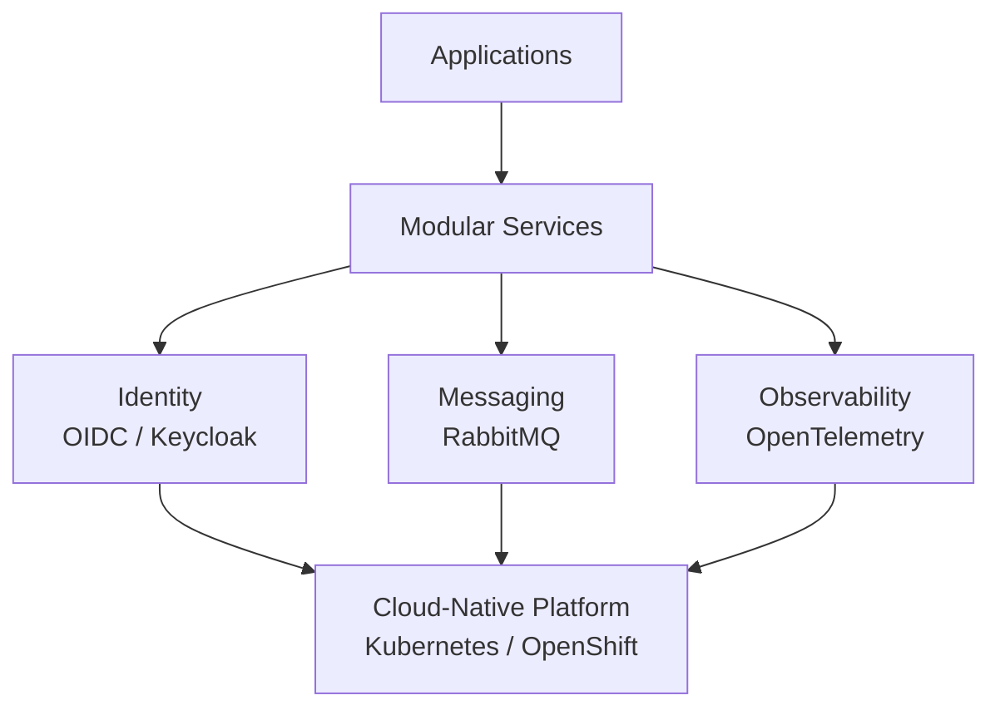

# 👋 Hi, I'm Rick Olvera

### Software Architect · DevOps · Platform Engineering

I design and build **modular, scalable and cloud-native software platforms**, with a strong focus on architecture, automation, reliability and long-term evolution.

I enjoy turning complex technical environments into **simple, observable and maintainable systems**.

---

## 🚀 What I do

- 🏗️ **Software Architecture** — modular, distributed and evolvable systems
- ☁️ **Cloud-Native Platforms** — containers, Kubernetes and OpenShift
- ⚙️ **DevOps & CI/CD** — automated build, test, security and delivery pipelines
- 🔄 **Platform Engineering** — reusable capabilities and developer-focused platforms
- 🔐 **Identity & Security** — OIDC, Keycloak and secure service-to-service communication
- 📡 **Observability** — telemetry, tracing, metrics and operational visibility
- 📨 **Distributed Systems** — messaging and event-driven architectures
- 🧩 **Domain-Driven Design** — bounded contexts and clear domain boundaries
- 🤖 **AI Engineering & Automation** — Claude Code skills and plugin marketplaces that automate institutional workflows

---

## 🧰 Technology Stack

### Architecture & Backend

`C#` · `.NET` · `REST APIs` · `Microservices` · `DDD` · `Event-Driven Architecture`

### Platform & DevOps

`GitLab CI/CD` · `Docker` · `Podman` · `Kubernetes` · `OpenShift` · `Argo CD`

### Integration & Infrastructure

`RabbitMQ` · `Keycloak` · `OpenTelemetry` · `PostgreSQL` · `MinIO`

### Frontend

`React` · `JavaScript` · `TypeScript`

---

## 🏗️ Architecture Principles

I am particularly interested in architectures that make systems easier to **understand, change, deploy and operate**.

### Principles I value

- **Modularity over monolithic coupling**
- **Clear boundaries over shared complexity**
- **Automation over manual operations**
- **Observability over guesswork**
- **Security by design**
- **Infrastructure as code**
- **Continuous delivery**
- **Technology choices driven by architecture, not fashion**

---

## 🔭 Current Interests

I'm exploring and building around:

- Cloud-native application platforms
- Platform Engineering
- Modular architectures
- Event-driven systems
- GitOps
- Kubernetes ecosystems
- Distributed tracing and observability
- Identity and zero-trust architectures
- Architecture governance and evolution
- Developer experience and engineering productivity

---

## 📌 Featured Work

**[claude_skills](https://github.com/olverarick/claude_skills)** — a plugin marketplace for Claude Code with skills for institutional technology architecture governance and IT management, each skill shipped as an independently versioned plugin.

> This profile is evolving. My goal is to publish **practical architecture patterns, DevOps experiments, reusable components and technical labs** rather than just collections of code.

Some areas I plan to showcase:

| Area | Focus |
|---|---|
| 🏗️ Architecture | Modular & distributed system patterns |
| ⚙️ DevOps | CI/CD, automation and GitOps |
| ☁️ Cloud Native | Kubernetes & OpenShift |
| 🔐 Security | Identity, OIDC and secure APIs |
| 📡 Observability | OpenTelemetry & distributed tracing |
| 📨 Integration | Messaging & event-driven systems |
| 🧪 Labs | Experiments, proofs of concept and technical notes |

---

## 💡 Engineering Philosophy

> **Build systems that are easier to understand, evolve and operate.**

Good architecture isn't about adding more technology.

It's about creating **clear boundaries, reducing unnecessary coupling and making change less expensive**.

---

## 📫 Let's Connect

If you're interested in **software architecture, DevOps, cloud-native platforms, distributed systems or engineering practices**, feel free to explore my repositories or connect with me.

---

  <i>Architecting systems · Automating delivery · Building for evolution</i>

